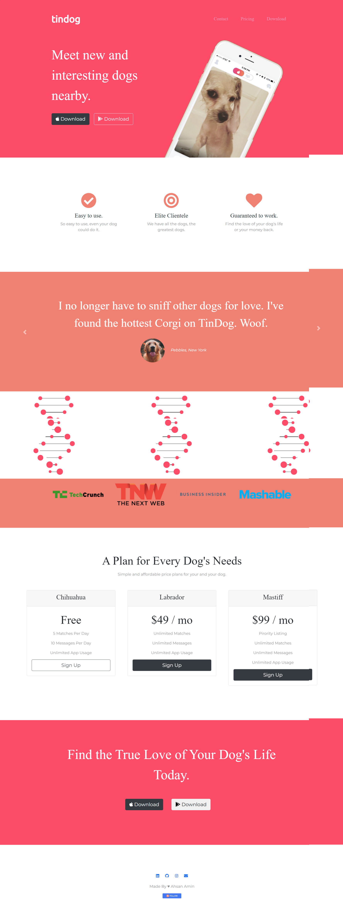

# TinDog
<b>HTML5, CSS & Bootstrap</b>
 
# Live Demo 🎥
<a href="https://ahsanami.github.io/tingdog.github.io/">Live Demo Link</a>

<\p>

# Build with
  <li>
    HTML5
  </li>
    <li>
    CSS3
  </li>
    <li>
    BootStrap5
  </li>
  
  
# Getting Started 🚀

Start by clicking the green button in the upper right corner to download the code.

# Contributing 🤝

I welcome contributions to this project! If you would like to contribute, please follow these steps:

 <li> Fork the repository and create a new branch for your changes. </li>
  <li> Make your changes and commit them with clear and descriptive messages.  </li>
  <li>Push your changes to your forked repository.   </li>
  <li>Create a pull request, describing your changes and why they should be merged into the main project.  </li>
   

Please make sure to follow our coding standards and best practices

# Authors 
<h2>🧑🏻 Ahsan Amin </h2>
            <h4>You can get in touch with me on my LinkedIn Profile:</h4>
            <li >
				<label>Linked In:<label><a href="https://www.linkedin.com/in/ahsan-amin-/">@linkedin</a>
			</li>
            <h4>You can also follow my GitHub Profile to stay updated about my latest projects</h4>
			<li >
				<label>GitHub:<label><a href="https://github.com/ahsanami">@github</a>
			</li>
		 
 If you liked the repo then kindly support it by giving it a star ⭐!

